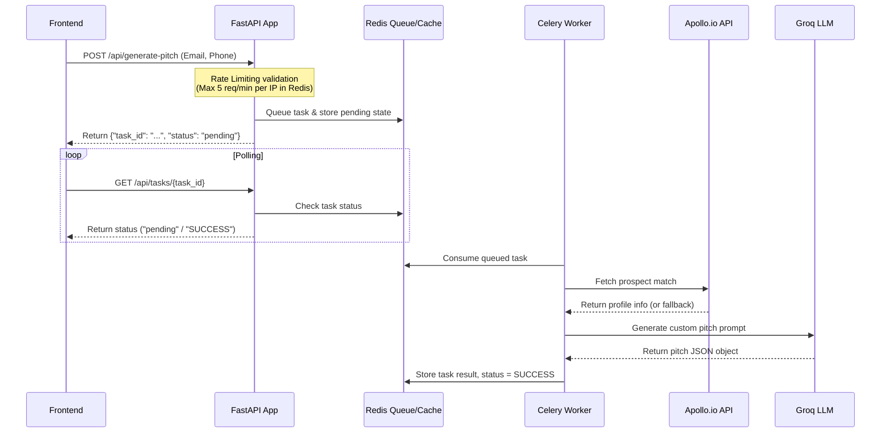

# 🚀 SalesCopilot - AI Agent Assist Pro

SalesCopilot is an advanced, production-optimized **AI-Powered Sales Assistant** that enriches lead data in real-time and synthesizes high-impact personalized sales pitches. 

This version features **Redis-backed sliding-window rate limiting** to prevent bot abuse, an **asynchronous Celery task queue** to handle concurrent requests without blocking, **structured error logging**, and a **Docker Compose orchestration** setup.

---

## 📁 Optimized Directory Structure

The project has been reorganized into a modular, scalable folder structure:

```
sale_pitch/
├── app/
│   ├── __init__.py
│   ├── main.py                # FastAPI entry point & CORS configuration
│   ├── config.py              # Settings manager (loads env vars using Pydantic Settings)
│   ├── routes/
│   │   ├── __init__.py
│   │   └── pitch.py           # Trigger endpoints, poll task state & rate limits
│   ├── tasks/
│   │   ├── __init__.py
│   │   ├── celery_app.py      # Celery task manager configuration
│   │   └── pitch_tasks.py     # Background workers tasks (Apollo matching & Groq LLM synthesis)
│   ├── utils/
│   │   ├── __init__.py
│   │   ├── rate_limiter.py    # Redis sliding-window IP rate limiter
│   │   └── logger.py          # Structured error and audit logging setup
│   └── static/                # Frontend application
│       ├── index.html
│       └── app.js             # Client UI, local persistence, copy events & async polling
├── docker-compose.yml         # Container orchestration configuration
├── Dockerfile                 # Unified Docker definition for Web & Worker
├── requirements.txt           # Python application dependencies
├── .env                       # API Credentials & configs
└── README.md                  # Project Documentation
```

---

## ⚡ Asynchronous Real-Time Architecture

To support high concurrency and protect external API rates, processing is decoupled from the HTTP cycle:



---

## 🛠️ Security, Performance & Concurrency Features

1. **Rate Limiting (Bot Protection)**:
   * Uses Redis to implement a sliding-window rate limiter on the `/api/generate-pitch` endpoint.
   * Restricts requests to **5 per minute per IP** by default.
   * **Failsafe Design**: If Redis goes offline, the rate limiter falls back to a local memory cache without interrupting operations.

2. **Concurrency & Offloaded Tasks**:
   * Blocking network calls (Apollo API lookup and Groq LLM synthesis) are moved out of the FastAPI main request threads into a background task queue managed by Celery.
   * Allows the API to support high concurrency, since it doesn't block waiting for external APIs to respond.

3. **Exception Handling & Auditing**:
   * A global middleware handler intercepts unhandled exceptions, logs them with stack traces, and returns clean JSON errors. This prevents sensitive debug details from leaking to callers.
   * Logs are written to stdout and automatically persisted in the `logs/` directory inside a rotating file `app.log`.

---

## 🖥️ How to Run & Verify

### Option A: Running with Docker Compose (Recommended)

Make sure you have Docker and Docker Compose installed.

1. **Configure Environment Variables**:
   Update the keys in `.env`:
   ```ini
   GROQ_API_KEY="your-groq-key"
   APOLLO_API_KEY="your-apollo-key"
   ```

2. **Launch Services**:
   In the root of the project (`d:\sale_pitch`), run:
   ```bash
   docker compose up --build -d
   ```
   This will spin up:
   * **Redis** (Broker and Rate limiter)
   * **Web** (FastAPI at `http://localhost:1010`)
   * **Worker** (Celery worker executing background enrichment/LLM calls)

3. **Check Logs**:
   To inspect what the services are doing:
   ```bash
   docker compose logs -f
   ```

4. **Shutdown Services**:
   ```bash
   docker compose down
   ```

---

### Option B: Running Locally

If you don't have Docker installed, you can run services individually using local instances of Redis:

1. **Start Redis server**:
   Ensure Redis is running locally on port `6379`.

2. **Set up Virtual Environment and Dependencies**:
   ```powershell
   python -m venv .venv
   .venv\Scripts\activate
   pip install -r requirements.txt
   ```

3. **Start Celery worker**:
   ```powershell
   celery -A app.tasks.celery_app.celery_app worker --loglevel=info
   ```

4. **Start FastAPI Uvicorn web server**:
   ```powershell
   uvicorn app.main:app --host 127.0.0.1 --port 1010 --reload
   ```

5. **Open app in Browser**:
   Navigate to 👉 **[http://127.0.0.1:1010](http://127.0.0.1:1010)**

---

## 🌐 Production Server Deployment (Git Setup & Launch)

Follow these steps to deploy this project on an Ubuntu/Linux production server:

### 1. Clone the Repository
SSH into your server and run:
```bash
# Clone the repository
git clone <your-repository-url>
cd sale_pitch
```

### 2. Set Up Environment Variables
Create the production environment file:
```bash
cp .env.example .env  # Or create it manually
nano .env
```
Ensure you set your active API keys and production configurations:
```ini
GROQ_API_KEY="your-production-groq-key"
APOLLO_API_KEY="your-production-apollo-key"
APOLLO_MATCH_URL="https://api.apollo.io/api/v1/people/match"
REVEAL_PERSONAL_EMAILS=False
REVEAL_PHONE_NUMBER=False

# Seller settings (Prompt customization)
SELLER_COMPANY="Clarion Technologies"
SELLER_SERVICES="offshore custom mobile app development, React Native..."
SELLER_VALUE_PROPS="up to 60% cost reduction..."
```

### 3. Run with Docker Compose (Production Mode)
Launch the application containers in detached background mode:
```bash
# Build and run all services
docker compose up --build -d
```
This launches:
* **Web Service** on port `1010` (mapped to host)
* **Redis** (internal backend broker and caching database)
* **Celery Worker** (to execute tasks asynchronously)

### 4. Verify the Deployment
Verify that all containers are healthy:
```bash
docker compose ps
```
Check the live application logs:
```bash
docker compose logs -f
```

To test the live API via `curl` from a remote machine:
```bash
curl --location 'http://<your-server-ip>:1010/api/generate-pitch' \
--header 'Content-Type: application/json' \
--data-raw '{
  "email": "arijit@c-zentrix.com",
  "phone": "+919845244545"
}'
```
